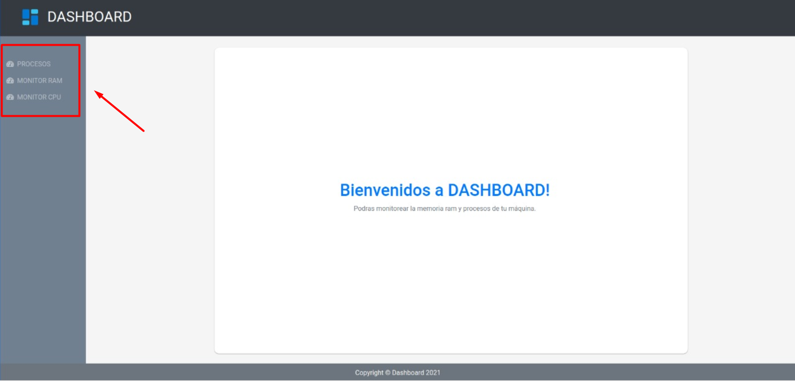
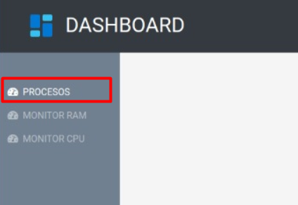
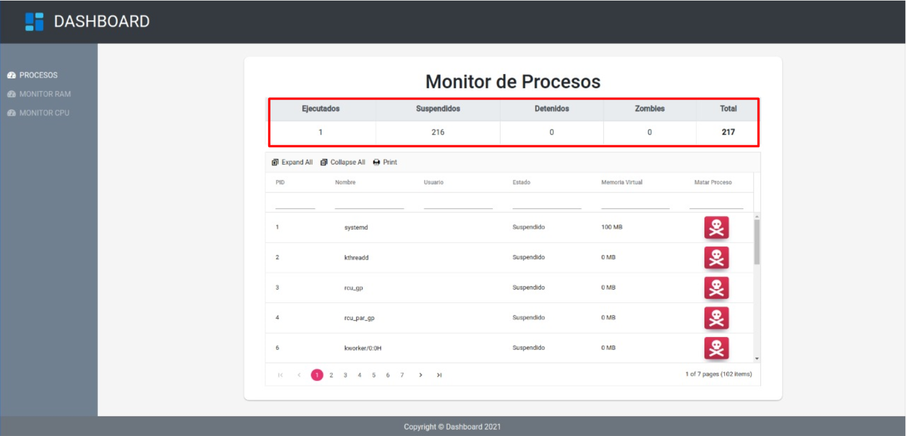
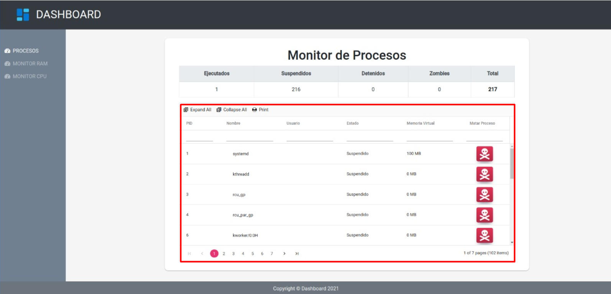
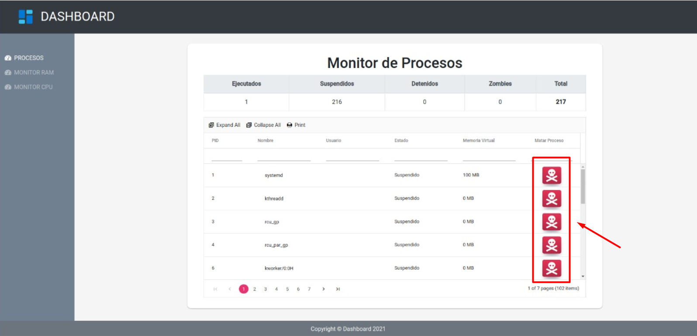
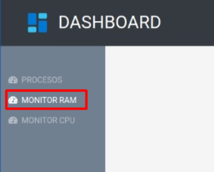
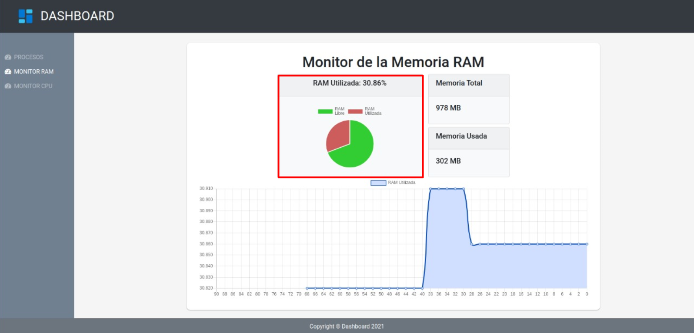
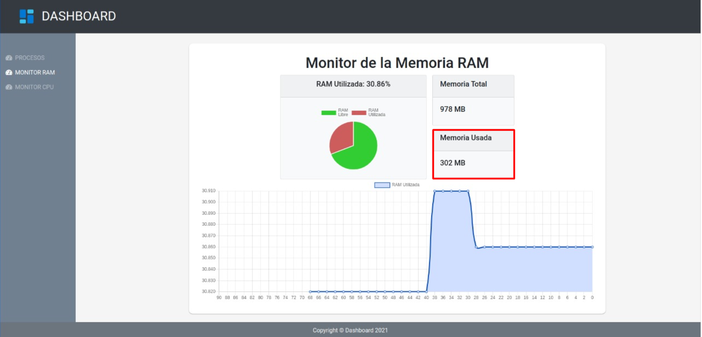
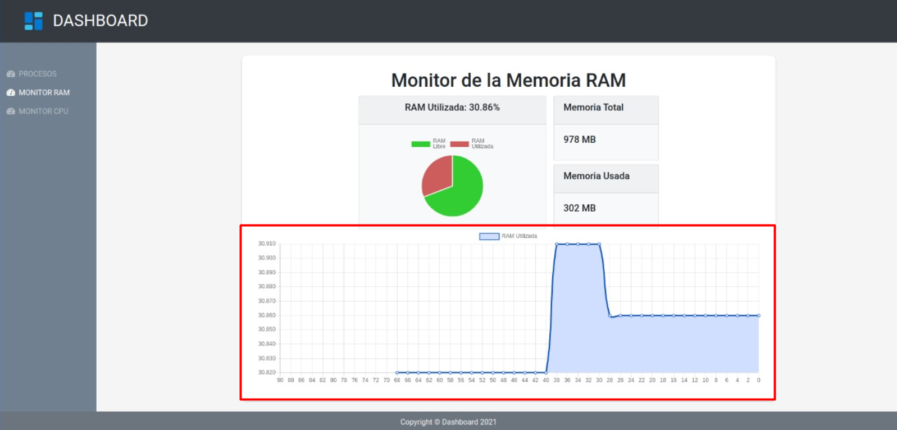

# Manual de Usuario

En el siguiente manual se detalla el uso de la aplicación web para monitorear el uso de la memoria RAM y procesos de una PC. Los requerimientos para poder ingresar a la página son:

* Navegador web (Google chrome, Mozilla, Edge)
* Acceso a internet

## Pantalla inicial

En la pantalla inicial observamos un menú lateral izquierdo en el cual se encuentra el acceso a cada uno de los dashboards individuales para el monitoreo de memoria RAM, cpu y procesos.

## Dashboard - Procesos

El primer dashboard permite monitorear los procesos, ingresamos dando clic en la primera opción del menú llamada **PROCESOS**.

* En la parte superior, se encuentra una tabla que muestra el conteo de procesos en cada uno de los estados que se obtienen a tráves del módulo de procesos.

    

* En la parte inferior, se encuentra una tabla con todos los procesos y datos importantes de cada uno de ellos, así como una opción para obtener los procesos hijos igualmente desplegando su información.

    

* Para cada uno de los procesos, en la ultima columna de la tabla se muestra un boton, el cual permite terminar el proceso correspondiente dando clic.

    

## Dashboard - Memoria RAM

El segundo dashboard permite monitorear el uso de la memoria RAM, ingresamos dando clic en la segunda opción del menú llamada **MONITOR RAM**.

* En la parte superior, se encuentra una gráfica circular que indica el porcentaje de uso de la memoria RAM.

    
    
* Tambíen se observa un recuadro con el total de memoria disponible en la PC que se esta monitoreando.

    

* A continuación se observa un recuadro con el total de memoria usada en la PC que se esta monitoreando.

    

* Y por ultimo en la parte inferior se muestra una gráfica de poligono que se encuentra mostrando en tiempo real el uso de la memoria.

    

